# Prog7313 

# Budget Tracker Wth Gamification 

 

## Table of Contents
- [Purpose](#purpose)
- [Design Considerations](#design-considerations)
- [Features](#features)
- [Technology Stack](#technology-stack)
- [GitHub and GitHub Actions](#github-and-github-actions)
- [Screenshots-How the app works](#screenshots)

## Purpose

This Android app is designed to help users manage their personal finances efficiently by tracking expenses, setting budget goals, and visualizing spending by category. Additionally, the app integrates **gamification features** such as achievements and rewards to motivate users to maintain healthy financial habits.

The key aims are:
- Simplify expense tracking with intuitive UI
- Provide visual insights through charts and summaries
- Encourage budgeting discipline via goals and progress tracking
- Increase user engagement by rewarding positive financial behavior

---

## Design Considerations

- **User-Centered Design:** The app features a clean, intuitive interface optimized for quick data entry and easy navigation via a navigation drawer.
- **Flexibility:** Users can select date ranges to filter expenses and view category totals.
- **Gamification:** Achievements encourage continuous engagement, tracking milestones such as first login, salary input, and goal adherence.
- **Offline Support:** Local caching strategies (future scope) to allow limited offline usage.
- **Performance:** Firebase Realtime Database provides scalable and real-time data syncing with minimal latency.
- **Security:** Firebase Authentication secures user data access; user-specific data is isolated by unique user IDs.
- **Extensibility:** Modular design allows easy integration of additional features like monthly summaries or mini-games.

---

## Features

- User registration and login with Firebase Authentication
- Expense creation with optional photo attachments
- Filtering expenses by custom date ranges
- Displaying totals per category in card views
- Salary day countdown widget on dashboard
- Achievement tracking with Firebase database flags
- Navigation drawer for smooth screen transitions
- Planned mini-game integration for budgeting reinforcement

---

## Technology Stack

- **Android SDK** (Kotlin)
- **Firebase Authentication** (User sign-in/sign-up)
- **Firebase Realtime Database** (Data storage and retrieval)
- **Glide** (Image loading and caching)
- **Material Design Components** (UI/UX elements)
- **Git & GitHub** (Version control and collaboration)

---

## GitHub and GitHub Actions

The source code for this project is maintained on GitHub, enabling:

- **Version Control:** Tracking changes and maintaining code history.
- **Collaboration:** Easy merging of contributions and issue tracking.
- **Branching Strategy:** Features and fixes developed on separate 

## screenshots

-User registers  
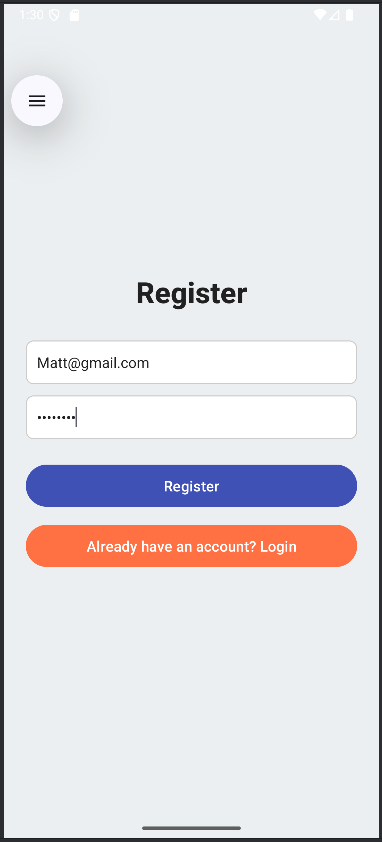

-user loggs in
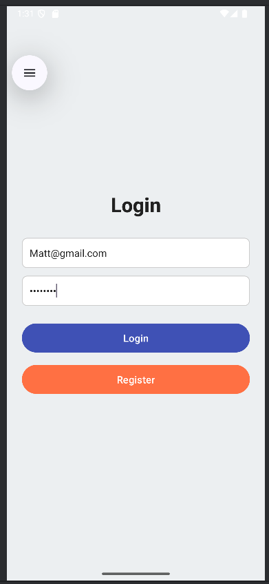

user will start at the dashboard page which will have a hamburger menu on the ise which they will pen and see all the pages 
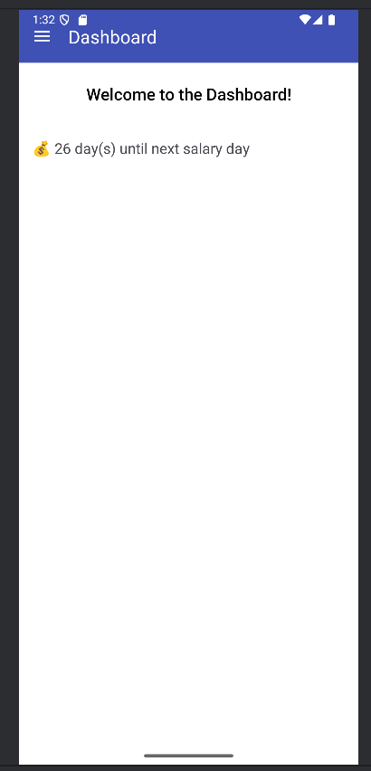
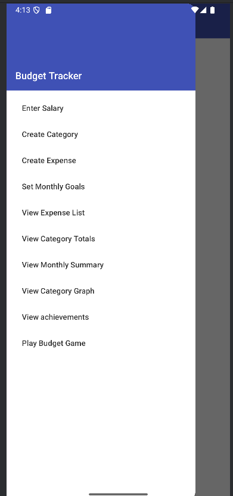

user will first enter their salary 
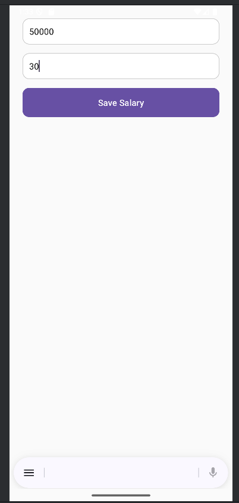

the the user will enter what category they want to add to track their expenses
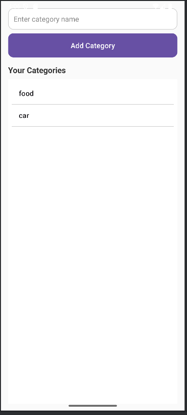

user will then set goals for the month and each category the min and max they spending 
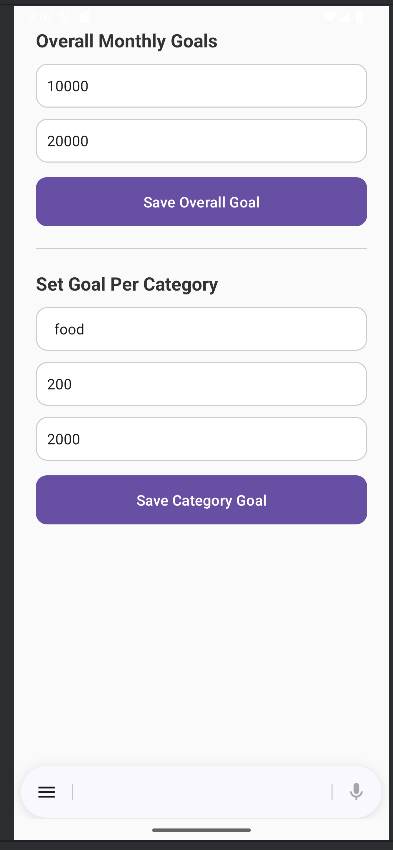

user will then enter their expense details and select which category the expense will go to and have an option to add a photo to that expense
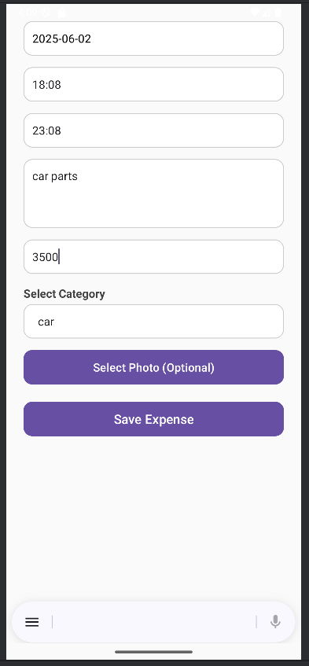

user can see their expenses form a specific date range 
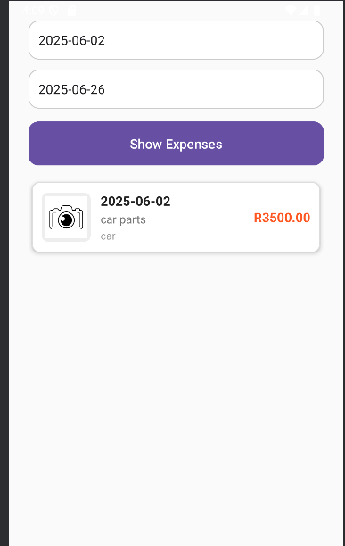

user can see all their categories from a specific date range and the total amount for that category that was spent 
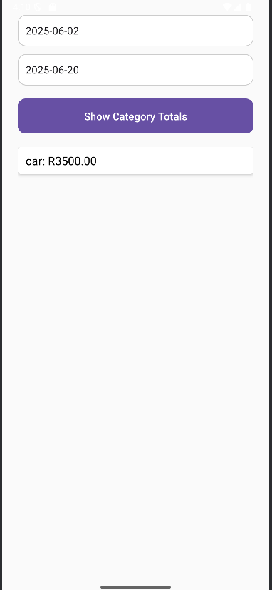

user can see their monthly summary of how much of their salary is used and how much they have left , see their category total spent for the month , can see their montly spending 
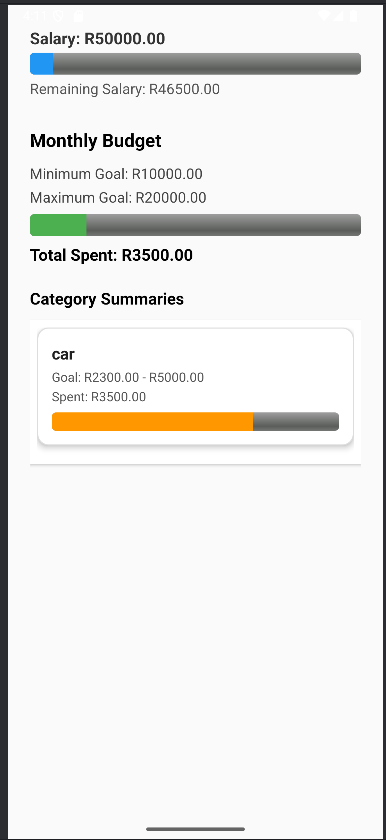

user can see their spending habity if its over the max and staying withing their budget , it will change colours according to their spending habits for each category 
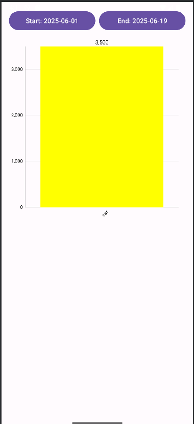

users will get achievements , achievements will be grey but will turn gold once its completed
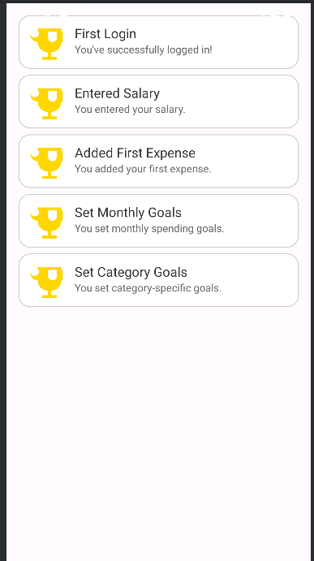

sers can play a bubble poping game to ease their mind
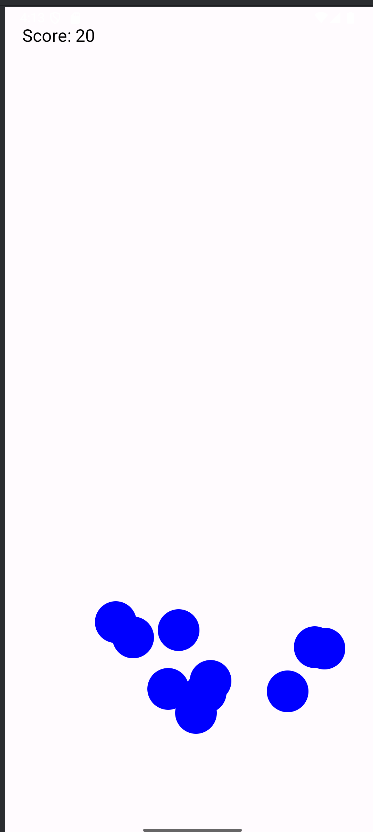

References 

ChatGPT. (2025). ChatGPT - Login Activity Improvement. [online] Available at: https://chatgpt.com/share/683e5d38-a7bc-8005-bc25-78598ba7506c [Accessed 3 Jun. 2025].

Kapp, K. (2012). The gamification of learning and instruction: Game-based methods and strategies for training and education. San Francisco: Wiley.

